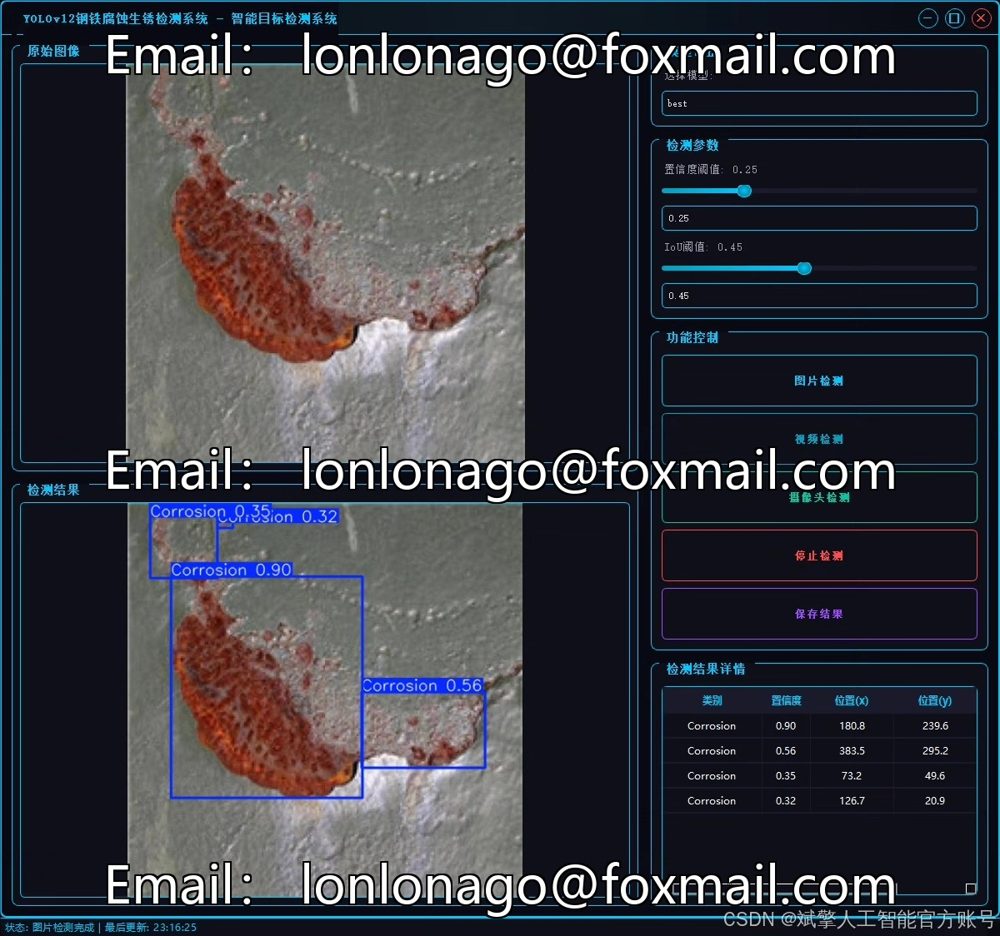
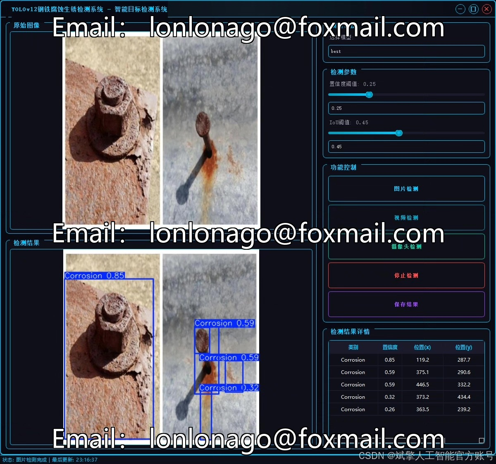
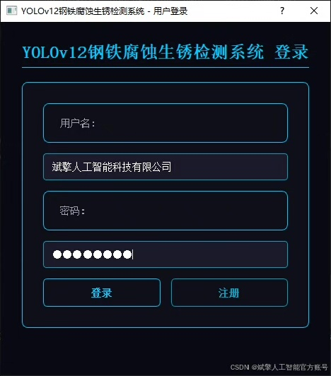
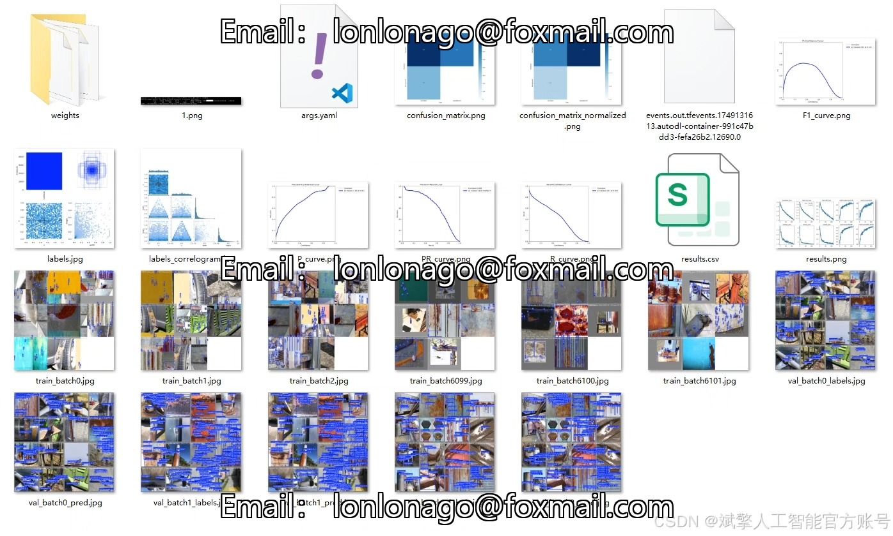
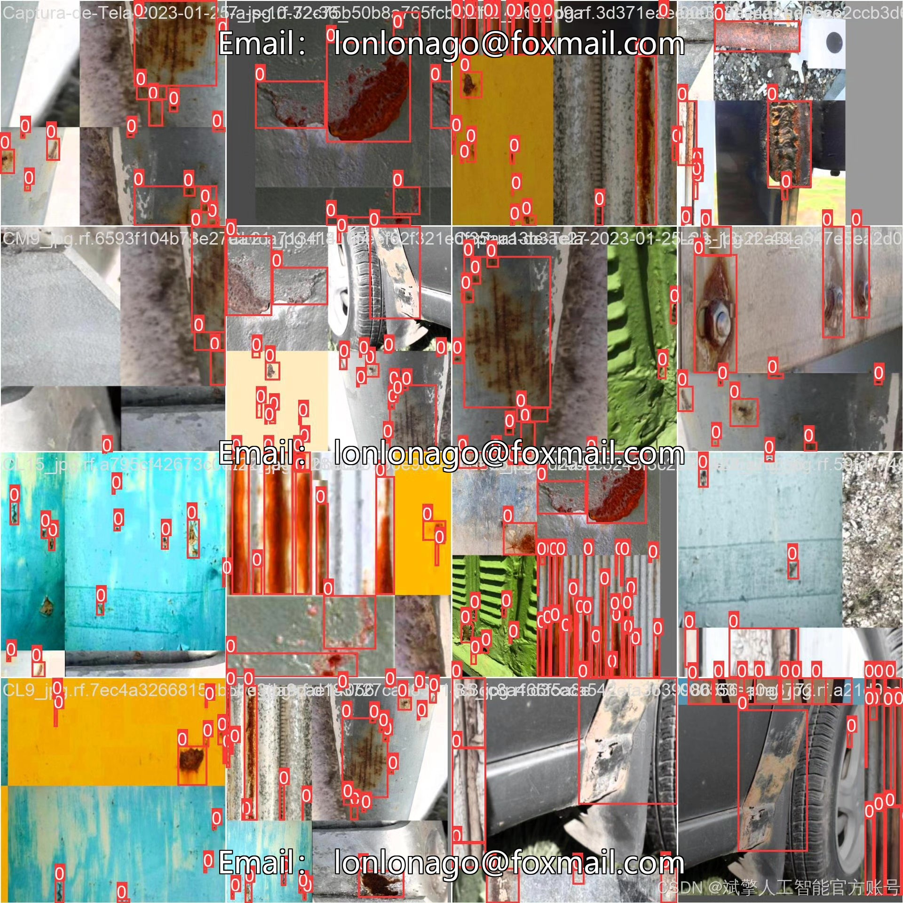
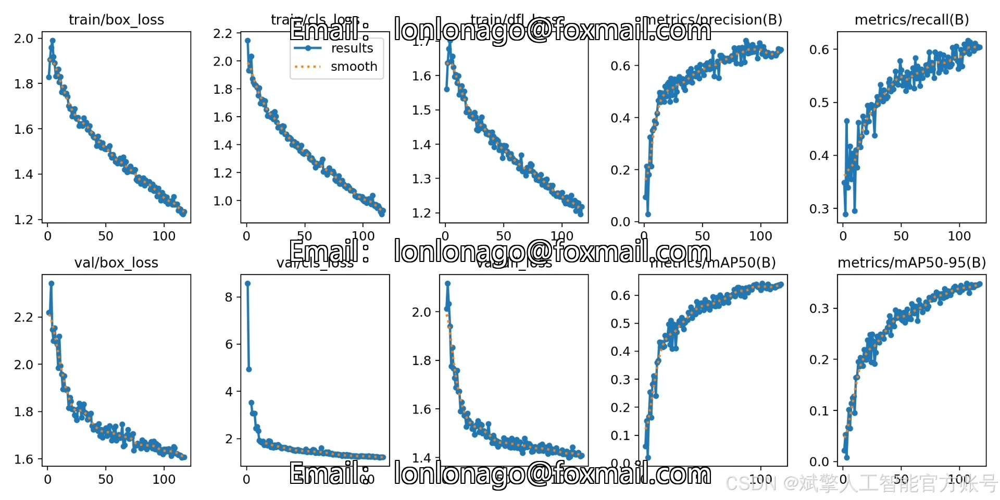
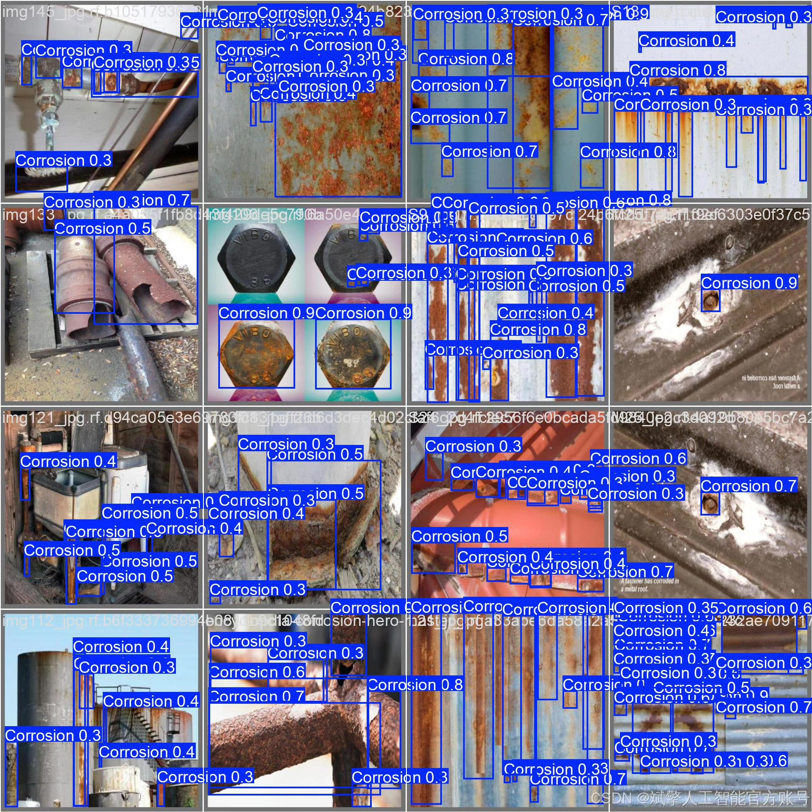

# YOLOv12 Steel Corrosion Detection System

## Body

YOLOv12 Steel Corrosion Detection System Based on Deep Learning YOLOv12: A Steel Corrosion and Rust Detection System (YOLOv12+YOLO dataset + UI interface + login registration interface + Python project source code + model)

Steel corrosion and rust are critical issues faced by industrial facilities, bridges, pipelines, and other steel structures over the long term, severely impacting structural safety and service life. This paper develops an efficient and accurate steel corrosion and rust detection system based on the deep learning target detection algorithm YOLOv12. The system utilizes the YOLOv12 model in conjunction with a dataset containing 600 labeled images for training, achieving real-time detection of corrosion areas. Additionally, the system integrates a user-friendly UI interface that supports login registration functions.

✅ User Login and Registration: Supports password verification and security validation.
✅ Three Detection Modes: Based on the YOLOv12 model, supporting image, video, and real-time camera detection, to accurately identify targets.
✅ Dual-Screen Comparison: Display original images and detection results on the same screen.
✅ Data Visualization: Real-time table displaying the category, confidence, and coordinates of detected targets.
✅ Intelligent Parameter Tuning: Offers a confidence slide bar to dynamically optimize detection accuracy, adapting to different scene requirements.
✅ Sci-Fi Interactive Interface: Dark theme paired with dynamic light effects to reduce visual fatigue and enhance operational experience.

## Images

## Payment

Here is a pay link on Stripe ( https://buy.stripe.com/3cs8yP7sY87d0vu9AB ). Please contact me lonlonago@foxmail.com after funding $89, and I will send you a complete data files , thank you!

